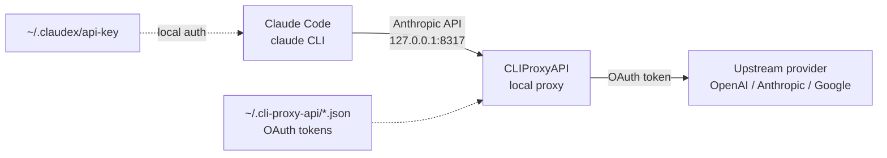

# claudex

Guided setup for running GPT/Codex (or Gemini) models inside [Claude Code](https://docs.anthropic.com/en/docs/claude-code) via [CLIProxyAPI](https://github.com/router-for-me/CLIProxyAPI).

claudex installs and configures a **local** CLIProxyAPI server, helps you authenticate Codex/Claude, and adds a `claudex` command that launches `claude` pointed at the proxy through Anthropic-compatible environment variables. You keep the Claude Code UX; the models behind it are yours to choose.

> [!NOTE]
> Onboarding is two moves: install, then `claudex-setup` — a guided wizard that walks you through OAuth, starting the proxy, and picking models. No command memorization required.

## Prerequisites

- **macOS or Linux** (arm64 or x86_64). Windows is not supported by these wrappers.
- **[Claude Code](https://docs.anthropic.com/en/docs/claude-code)** installed (the `claude` command). claudex wraps it; it does not install it.
- **`bash`, `curl`, `python3`** (present on macOS and most Linux distros).
- A **Codex/ChatGPT account** (and/or Claude, Gemini) to authenticate the proxy against.
- Optional: **[`fzf`](https://github.com/junegunn/fzf)** for fuzzy model selection; **git** (required for the one-line bootstrap); **Homebrew** (only if you opt into a system CLIProxyAPI via `CLAUDEX_USE_SYSTEM_CLIPROXY=1`).

Verify your setup at any time with `claudex-doctor`.

## Quick start

One line, pinned to a released version — clones the repo at that tag and runs the verified installer:

```bash
CLAUDEX_REF=v0.1.0 bash -c "$(curl -fsSL https://raw.githubusercontent.com/Davshiv20/claudex/v0.1.0/bootstrap.sh)"
```

If you have a terminal it drops you straight into the guided setup; otherwise open a new shell and run `claudex-setup`. That wizard handles sign-in, starts the proxy, and lets you pick your models. Then:

```bash
claudex
```

### Prefer to read before you run? (recommended)

Download the bootstrap, read it, then run it:

```bash
curl -fsSLO https://raw.githubusercontent.com/Davshiv20/claudex/v0.1.0/bootstrap.sh
less bootstrap.sh
CLAUDEX_REF=v0.1.0 bash bootstrap.sh
```

Or clone and install manually — same result:

```bash
git clone --branch v0.1.0 https://github.com/Davshiv20/claudex.git
cd claudex
./install.sh --setup    # runs the guided wizard right after installing
```

The bootstrap only clones this repo and runs `install.sh` — it pipes no opaque logic into your shell, and the CLIProxyAPI binary is still checksum-verified. Run `claudex-doctor` any time to check your setup.

### Bleeding edge

Install the latest unreleased `main` (mutable — use a tag for reproducibility):

```bash
CLAUDEX_REF=main bash -c "$(curl -fsSL https://raw.githubusercontent.com/Davshiv20/claudex/main/bootstrap.sh)"
```

(`CLAUDEX_REF` controls which repo ref the bootstrap clones; it defaults to `main`, so pinned installs set it explicitly.)

### What the wizard does

`claudex-setup` is just: `claudex-auth codex` (or `codex-device` on SSH/headless) → `claudex-proxy start` → `claudex-models set`. It auto-suggests device-code login when it detects an SSH or headless session, and skips steps you've already completed.

## Choosing your models

Claude Code has only three model slots: **Opus**, **Sonnet**, and **Haiku**.
claudex lets you decide which real model powers each slot.

The easiest way is the **guided picker** — it lists the models your account can
actually use and lets you choose by number (or fuzzy-search, if `fzf` is
installed). No IDs to memorize:

```bash
claudex-models set          # walks through Opus, then Sonnet, then Haiku
claudex-models set opus      # just re-pick one slot
```

Each step shows which slot you're configuring, your current choice, the list of
available (chat-capable) models, and a reasoning-effort menu (high/medium/low/none).

Prefer to type it directly? Pass the model and skip the prompts:

```bash
claudex-models set haiku gpt-5.4-mini(low)
```

Quickly dial effort up or down across all slots with a **profile**:

```bash
claudex-models profile cheap      # every slot -> low effort
claudex-models profile balanced   # high / medium / low
claudex-models profile max        # high / high / medium
```

Other commands:

```bash
claudex-models list   # every model your account can use (proxy must be running)
claudex-models show   # the current map
claudex-models edit   # open ~/.claudex/models.conf in your editor
```

The `(high|medium|low)` suffix is optional and sets reasoning effort.
Everything is stored in a plain, commented file at `~/.claudex/models.conf`.

When you run `claudex`, it prints the active map so it's never a mystery:

```
[claudex] Opus:gpt-5.5(high)  Sonnet:gpt-5.5(medium)  Haiku:gpt-5.4-mini(low)
```

### Model resolution precedence

1. `CLAUDEX_OPUS_MODEL` / `CLAUDEX_SONNET_MODEL` / `CLAUDEX_HAIKU_MODEL` env vars
2. `~/.claudex/models.conf`
3. built-in fallback (`gpt-5-codex(...)`)

So you can override a single run without touching your config:

```bash
CLAUDEX_SONNET_MODEL='gpt-5.5(high)' claudex
```

## How it works / data flow

Everything runs on your machine. Claude Code talks to `127.0.0.1`, and the proxy
forwards requests to the upstream provider using your OAuth credentials.



- **Local-only by default.** The proxy binds to `127.0.0.1:8317`; nothing is exposed to your network.
- **Local auth token.** A random `sk-claudex-…` key in `~/.claudex/api-key` authenticates Claude Code to the proxy. It is not an provider key and never leaves your machine.
- **Provider OAuth.** `claudex-auth` performs a normal browser OAuth login. Tokens are stored by CLIProxyAPI under `~/.cli-proxy-api/` (mode `0600`) and are **never** part of this repo.
- **Your prompts and code** flow from Claude Code → local proxy → your chosen provider, exactly as they would if you used that provider directly. claudex adds no telemetry of its own.

## Billing & cost

- claudex is free and does not bill you. **Your usage is billed by the upstream provider** (OpenAI/Anthropic/Google) according to your account/plan.
- Model choice and reasoning effort directly affect cost and latency. `high` effort is slower and more expensive; use `claudex-models profile cheap` to dial everything down.
- Costs shown inside Claude Code's model picker come from Claude Code, not from claudex, and may not reflect your actual provider pricing.

## Telemetry

- CLIProxyAPI's usage statistics are **disabled by default** in the config claudex writes (`usage-statistics-enabled: false`). Set it to `true` in `~/.cli-proxy-api/config.yaml` to opt in.
- claudex itself sends no telemetry.

## Security & supply chain

- **Verified binary by default.** The installer downloads the vouched, pinned CLIProxyAPI version and verifies its **SHA256 against a hash embedded in this repo** (not one fetched from the same release), then keeps it at `~/.claudex/bin/cli-proxy-api`. A mismatch aborts the install. This verified binary is preferred by all claudex commands at runtime.
- **System binary is opt-in.** claudex will **not** silently use a `cliproxyapi`/`cli-proxy-api` already on your `PATH` or a Homebrew install, because those are not version-pinned or checksum-verified. Opt in explicitly with `CLAUDEX_USE_SYSTEM_CLIPROXY=1` (you'll get a warning).
- **Checksums.** The pinned version is verified against the in-repo hash. For any *other* version (including `latest`), verification is best-effort against that release's own `checksums.txt` — this catches corrupted downloads but is not an independent signature.
- **Minimum release age (fail-closed).** Any version other than the vouched pin (including `latest`) must be at least **7 days old**. If claudex can't prove the age (e.g. network down or unknown tag), it **refuses** rather than proceeding. Tune with `CLAUDEX_MIN_RELEASE_AGE_DAYS` (set `0` to disable), or bypass with `CLAUDEX_SKIP_RELEASE_AGE_CHECK=1`.
- **Private secrets.** The installer runs with `umask 077` and writes `api-key` and `config.yaml` atomically at mode `0600` — they are never briefly world-readable.
- **Non-destructive config.** An existing `~/.cli-proxy-api/config.yaml` is **preserved**; pass `--reset` to overwrite (a timestamped backup is kept either way).
- **Safe process control.** `claudex-proxy stop` only kills a PID whose command references *our* config file and whose executable is a cli-proxy-api binary, waits for it to actually exit (`--force` escalates to SIGKILL), and clears stale PID files — so it won't kill or falsely claim to stop an unrelated process.
- **Guarded uninstall.** `claudex-uninstall` refuses to `rm -rf` dangerous paths (`/`, `$HOME`, ancestors of home, top-level dirs) and requires confirmation (or `--yes`), so a mis-set `CLAUDEX_INSTALL_DIR` can't wipe your home directory.

Install options:

```bash
./install.sh --reset                               # overwrite existing CLIProxy config
CLAUDEX_CLIPROXY_VERSION=v7.2.93 ./install.sh       # pin a specific version
CLAUDEX_CLIPROXY_VERSION=latest ./install.sh        # newest release >= min age
CLAUDEX_MIN_RELEASE_AGE_DAYS=14 ./install.sh        # stricter soak period
CLAUDEX_USE_SYSTEM_CLIPROXY=1 ./install.sh          # use system/Homebrew binary (unverified)
```

## Maintenance

```bash
claudex-doctor              # health check: deps, perms, auth, proxy, model map
claudex-update              # pull latest repo + refresh CLIProxyAPI and wrappers
claudex-proxy stop --force  # force-stop the proxy if it won't exit cleanly
claudex-uninstall           # remove wrappers, config, PATH/alias (keeps OAuth tokens)
claudex-uninstall --purge   # also delete ~/.cli-proxy-api (OAuth tokens included)
claudex-uninstall --yes     # skip the confirmation prompt
```

## What gets installed

- CLIProxyAPI binary (pinned, checksum-verified release binary at `~/.claudex/bin/cli-proxy-api`; system/Homebrew binary only with `CLAUDEX_USE_SYSTEM_CLIPROXY=1`)
- `~/.cli-proxy-api/config.yaml` and `~/.cli-proxy-api/` for OAuth tokens/logs
- `~/.claudex/api-key` (local proxy auth token, mode `0600`)
- `~/.claudex/models.conf` (your Opus/Sonnet/Haiku model map)
- wrapper commands in `~/.claudex/bin`:
  - `claudex` — launch Claude Code with your model map
  - `claudex-setup` — guided first-run onboarding
  - `claudex-auth` — OAuth login (codex/claude)
  - `claudex-proxy` — start/stop/status/logs/models
  - `claudex-models` — pick/list/show/profile models
  - `claudex-doctor` — health check
  - `claudex-update` — update in place
  - `claudex-uninstall` — clean removal
- a PATH + alias snippet in `~/.zshrc`, `~/.bashrc`, or `~/.profile`

## Troubleshooting

| Symptom | Try |
| --- | --- |
| `claudex` says Claude Code not found | Install Claude Code so `claude` is on your `PATH`. |
| Commands not found after install | Open a new shell or `source ~/.zshrc`. |
| `proxy not reachable` | `claudex-proxy start`, then `claudex-proxy status`. Check `claudex-proxy logs`. |
| `claudex-models list` fails | The proxy must be running and you must be authenticated (`claudex-auth codex`). |
| Model picker shows nothing | No chat models for your account, or the proxy is down. Run `claudex-doctor`. |
| Checksum mismatch on install | Re-run; if it persists, the release may have changed. Do **not** use `CLAUDEX_SKIP_CHECKSUM=1` unless you trust the source. |
| Auth expired | Re-run `claudex-auth codex` (or `claude`). |

Start with `claudex-doctor` — it points at the most likely fix.

## Compatibility

| Component | Supported |
| --- | --- |
| OS | macOS (arm64/x86_64), Linux (arm64/x86_64) |
| Shell | zsh, bash (profile fallback otherwise) |
| Claude Code | v1.x and v2.x (v1.x also gets `ANTHROPIC_MODEL` / `ANTHROPIC_SMALL_FAST_MODEL`) |
| CLIProxyAPI | pinned `v7.2.93` (override with `CLAUDEX_CLIPROXY_VERSION`) |

## Development

```bash
bash tests/run.sh    # static checks + hermetic unit/integration tests (no network)
```

CI runs the same suite on macOS and Linux via GitHub Actions (`.github/workflows/ci.yml`).

## License

[MIT](./LICENSE) © 2026 Shivam
